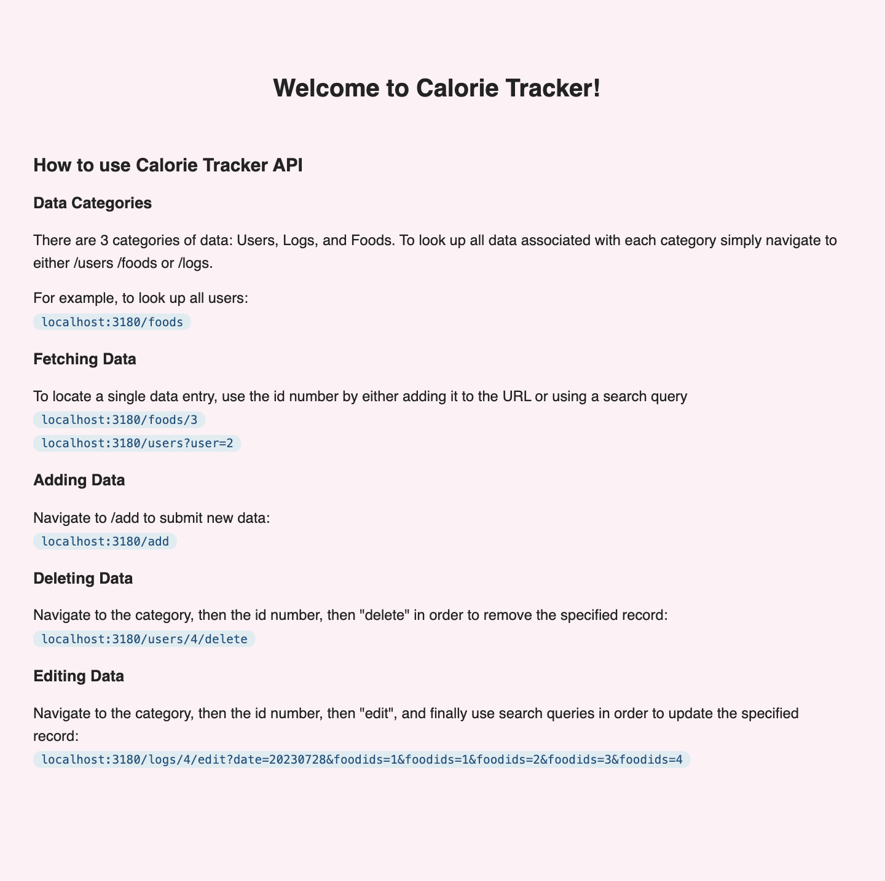
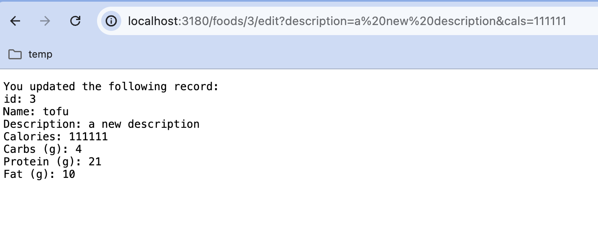
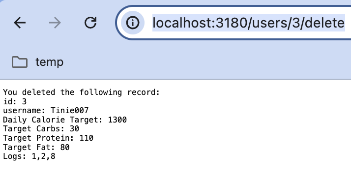
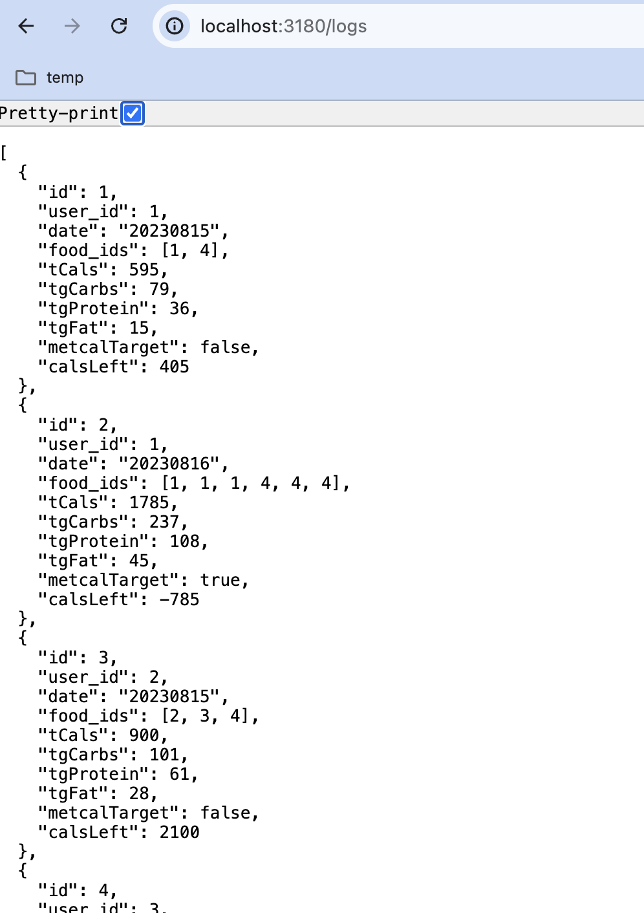

# Your Own Art Gallery
This project is a features an API that serves data from static data files. I used Express to organize the site,

## Table of Contents
- [Installation](#installation)
- [Usage](#usage)
- [Features](#features)
- [Acknowledgements](#acknowledgements)
  
## Installation

##### Clone the repository

git clone https://github.com/steph2017/318_SBA.git

##### Navigate to the project directory
cd your-repo-name

##### Run the file
npm start

## Features

- Landing Page and "Add data" page powered by Pug template engine:

- Dynamic routes enabled by query and path parameters

  
- Users can interact with the API to Create, Read, Update, Delete data entries
  
  

 
## Usage
- Review the landing page for usage instructions.

## Acknowledgements
This was made possible by:
- Instruction from [Tishana](https://github.com/tishana) and [Manara](https://github.com/Manara-Ali) under the [Per Scholas Software Engineering Immersive]https://perscholas.org/courses/software-engineer/
- [Pug](https://pugjs.org/api/getting-started.html) for front-end rendering, [Express.js](https://expressjs.com/en/starter/installing.html) for server functionality and tourbleshooting resources such as [Stack Overflow](https://stackoverflow.com/).
